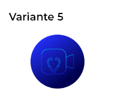
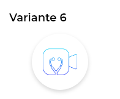

# MidoconlineiOSSDK

Bienvenido al SDK de Midoconline. Este kit te permite integrar fácilmente un botón dentro de tu aplicación para conectar a tus usuarios con Médicos, Psicólogos y Nutriólogos en línea. Ver su agenda, chatear y descargar recetas, dietas u ordenes de estudio.
Con una sola implementación, puedes brindar acceso directo a consultas de salud confiables, sin salir de tu app. Ideal para apps que desean agregar servicios de salud con una integración rápida, segura y sin complicaciones.

---

## 1. Instalación

### Swift Package Manager (SPM)

1. En Xcode, ve a **File > Add Packages...**  
2. Ingresa la URL del repositorio:  https://github.com/BoldBlueTechnologies/MidoconlineiOSSDK.git

3. Selecciona la rama `main`.
4. Añade el paquete a tu proyecto y, una vez finalizado, podrás importar el módulo con:
```swift
import MidoconlineiOSSDK
```
## 2. Uso

El SDK ofrece un botón personalizado en 3 versiones diferentes (short, medium y circle) el cual podrás usar dependiendo tus necesidades. Cada versión cuenta con 2 opciones de color (.blue y .white)

2.1 Ejemplo de integración Short version .blue

```swift

   let padding: CGFloat = 20
    
        let btn = PMButton(style: .short(kind: .blue))  
        view.addSubview(btn)
     
        let guide = view.safeAreaLayoutGuide

        NSLayoutConstraint.activate([
            btn.topAnchor.constraint(equalTo: guide.topAnchor, constant: 40),
            btn.leadingAnchor.constraint(equalTo: guide.leadingAnchor, constant: padding),
            btn.trailingAnchor.constraint(equalTo: guide.trailingAnchor, constant: -padding)
        ])
         

```
 

2.2 Ejemplo de integración Short version .white

```swift


   let padding: CGFloat = 20
    
        let btn = PMButton(style: .short(kind: .white))  
        view.addSubview(btn)
     
        let guide = view.safeAreaLayoutGuide

        NSLayoutConstraint.activate([
            btn.topAnchor.constraint(equalTo: guide.topAnchor, constant: 40),
            btn.leadingAnchor.constraint(equalTo: guide.leadingAnchor, constant: padding),
            btn.trailingAnchor.constraint(equalTo: guide.trailingAnchor, constant: -padding)
        ])
         

```


2.3 Ejemplo de integración Medium version .blue

```swift

   let btn = PMButton(style: .medium(kind: .blue)) 
        btn.translatesAutoresizingMaskIntoConstraints = false
        view.addSubview(btn)

        NSLayoutConstraint.activate([
            btn.centerXAnchor.constraint(equalTo: view.centerXAnchor),
            btn.topAnchor.constraint(equalTo: view.safeAreaLayoutGuide.topAnchor, constant: 220)
          
        ])
         
```
 

2.4 Ejemplo de integración Medium version .white

```swift

   let btn = PMButton(style: .medium(kind: .white))
        btn.translatesAutoresizingMaskIntoConstraints = false
        view.addSubview(btn)

        NSLayoutConstraint.activate([
            btn.centerXAnchor.constraint(equalTo: view.centerXAnchor),
            btn.topAnchor.constraint(equalTo: view.safeAreaLayoutGuide.topAnchor, constant: 220)
          
        ])
         
```


2.5 Ejemplo de integración Circle version .blue

```swift

   let btn  = PMButton(style: .circle(kind: .blue)) 
        view.addSubview(btn)
        NSLayoutConstraint.activate([
            btn.centerXAnchor.constraint(equalTo: view.centerXAnchor),
            btn.topAnchor.constraint(equalTo: view.safeAreaLayoutGuide.topAnchor, constant: 120)
        ])
        
```


2.6 Ejemplo de integración Circle version .white

```swift

   let btn  = PMButton(style: .circle(kind: .white)) 
        view.addSubview(btn)
        NSLayoutConstraint.activate([
            btn.centerXAnchor.constraint(equalTo: view.centerXAnchor),
            btn.topAnchor.constraint(equalTo: view.safeAreaLayoutGuide.topAnchor, constant: 120)
        ])
        
```
 

## 3. Requerimientos

iOS: iOS 14 o superior
Swift: Swift 5 o superior
Xcode: 15 o superior recomendado


## 4. Soporte
Si tienes dudas, sugerencias o problemas:

Abre un issue en este repositorio.
O contacta al equipo de Bold Blue Technologies.


